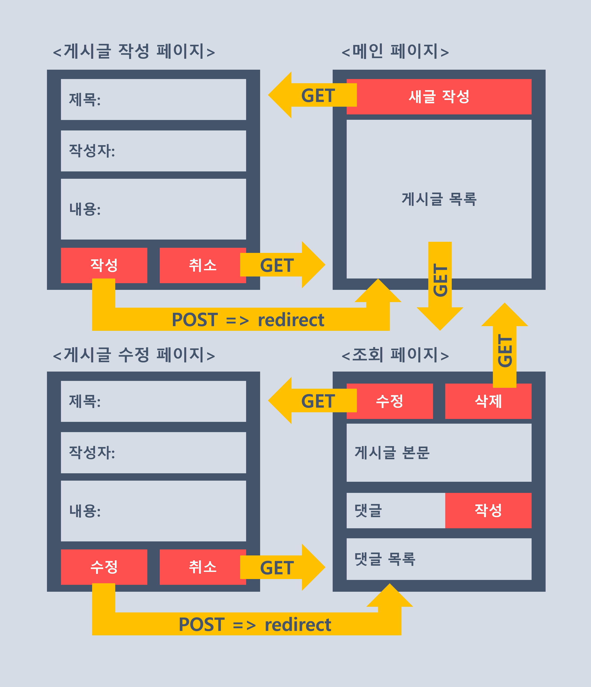

# CRUD 블로그 만들기

## 개요
### 기능
1. 게시글 CRUD
2. 댓글 CRUD
### 스택
node: v14.17.5   
express: v4.17.3   
mongoose: v6.2.10   
pug: v3.0.2   

## 버전별 주요 특징 (변경사항)
### 22/04/09 (최초버젼)
> ### 0. 주요 기능
>> 1. 게시글 작성/ 조회/ 수정/ 삭제   
>> 2. 댓글 작성/ 조회/ 수정/ 삭제
> ### 1. 특징
>> post 모델의 comment 필드(배열) 타입: comment 객체 

### 22/04/11 14:21
> ### 0. 기능 변경 없음
> ### 1. post, comment 스키마 별도로 구분
> #### 1-1. <이유> 별도로 구분하면 데이터 조작이 수월: CRUD 관점   
> #### 1-2. <문제> comment 컬렉션이 너무 커져서 search하는데 너무 오래 걸리지 않을까?
> ### 2. post 모델의 comment 필드(배열) 타입 수정 
>> 당초- comment 객체   
>> 변경- comment 다큐먼트의 id
> ### 3. post 게시날짜 역순 정렬 수정
> #### 3-1. <이유> 코드 길이 줄이기   
> #### 3-2. <문제> 속도는 어떤게 더 빠를까? 
>> 당초- 서버에서 정렬: post.reverse();   
>> 변경- DB에서 받아올 때 정렬: Post.find({}).sort({ createdAt: -1 });

### 22/04/11 15:50
> ### 0. 기능 변경 없음
> ### 1. 예외처리
> #### 1-1. DB에서 post, comment를 못찾을 경우 404페이지 return
> #### 1-2. post, comment Create 실패시 400 응답 (try...catch)
> ### 2. post 삭제시 post에 달린 comments 모두 DB에서 삭제
> #### 2-1. <이유> comments를 DB에 남길 이유가 없음
>> 당초- post만 삭제   
>> 변경- post에 따른 comments 모두 삭제
> ```javascript
> // src/routes/index.js 75~79줄
> // post와 연관된 comments 삭제
> const { comments } = post;
> for (const comment of comments) {
>     await Comment.findByIdAndDelete(comment._id);
> }
> ```

## 와이어프레임


## API
### 1. 전체 게시글 목록 조회
#### Request
> method: GET   
> URL: /    

#### Response
> HTTP 상태코드: 200    
> payload: { posts }

### 2. 게시글 작성
#### Request
> method: GET, POST   
> URL: /posts   
> body: { title, author, contents }

#### Response
> HTTP 상태코드: 200    
> payload: {}   

### 3. 게시글 조회
#### Request
> method: GET   
> URL: /posts/:id

#### Response
> HTTP 상태코드: 200    
> payload: { post }

### 4. 게시글 수정
#### Request
> method: GET, POST   
> URL: /posts/:id/edit   
> body: { title, author, contents }

#### Response
> HTTP 상태코드: 200    
> payload: { post }

### 5. 게시글 삭제
#### Request
> method: GET   
> URL: /posts/:id/delete

#### Response
> HTTP 상태코드: 200    
> payload: {}

### 6. 댓글 목록 조회
#### 게시글 데이터에 포함 

### 7. 댓글 작성
#### Request
> method: GET   
> URL: /posts/:id/comments   
> body: { author, contents } 

#### Response
> HTTP 상태코드: 200    
> payload: {}

### 8. 댓글 수정
#### Request
> method: GET, POST   
> URL: /posts/:id/:commentId/edit   
> body: { author, contents }

#### Response
> HTTP 상태코드: 200    
> payload: { post, comment }

### 9. 댓글 삭제
#### Request
> method: GET   
> URL: /posts/:id/:commentId/delete

#### Response
> HTTP 상태코드: 200    
> payload: {}
